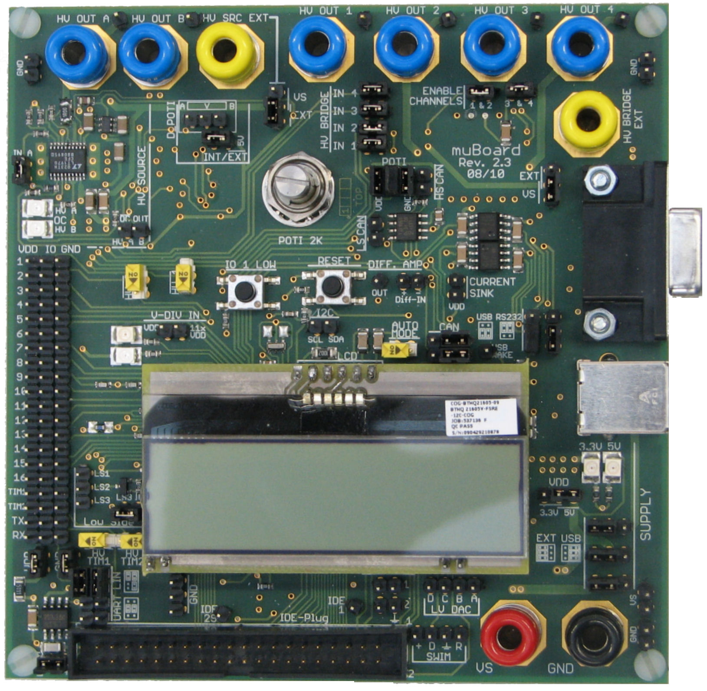

muBoard v2.3 specific routines and macros. This board was developed for IC validation and testing at [Robert Bosch GmbH](http://www.bosch.com).  
For an overview of board functions see [here](https://frosch.piandmore.de//de/pam9/call/public-media/event_media/160611_Vortrag_Interpreter.pdf) (in German).  
Are automatically searched by the build process -> names have to be unique

A description of commands and API is found in the [Wiki](https://github.com/gicking/STM8_templates/wiki)

  

